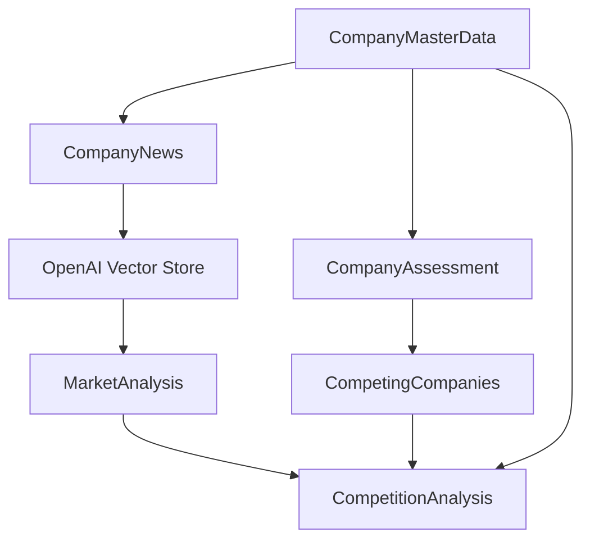

# Customer Intel

Customer Intel processes company data through SST-managed queues and Lambdas to enrich Weaviate collections, run OpenAI generations, and populate vector stores for downstream research.

## Prerequisites
- Node.js 18+ and `pnpm` installed.
- AWS credentials configured for your target stage.
- Secrets set via SST for each stage:
  - `OpenAIApiKey`
  - `WeaviateAPIKey`
- The Weaviate endpoint is defined in `sst.config.ts` and passed to functions through `environment`.

## Installation
```bash
pnpm install
```

## Secrets and environment
Set secrets per stage before running `sst dev` or deploying:
```bash
pnpm dlx sst secrets set --stage <stage> OpenAIApiKey <value>
pnpm dlx sst secrets set --stage <stage> WeaviateAPIKey <value>
```

## Local development
- Lint the code and EJS templates:
  ```bash
  pnpm lint
  pnpm lint:ejs
  ```
- Start the SST dev environment (using `pnpx` via `pnpm dlx`):
  ```bash
  pnpm dlx sst dev --stage <stage>
  ```
- Deploy to a stage:
  ```bash
  pnpm dlx sst deploy --stage <stage>
  ```

## Manual Lambda invocations
Use AWS CLI discovery to avoid hardcoding Lambda names. Replace `<stage>` and `example.com` as needed.

- Create (or recreate) Weaviate collections:
  ```bash
  COLLECTION_FN=$(aws lambda list-functions \
    --query "Functions[?contains(FunctionName, 'WeaviateCollectionCreatorFunction')].FunctionName | [0]" \
    --output text)
  aws lambda invoke --function-name "$COLLECTION_FN" collection.json
  ```
- Trigger master data entrypoint:
  ```bash
  MASTERDATA_FN=$(aws lambda list-functions \
    --query "Functions[?contains(FunctionName, 'MasterDataCallDownStreamHandlerFunction')].FunctionName | [0]" \
    --output text)
  aws lambda invoke --function-name "$MASTERDATA_FN" \
    --payload '{"legalName":"Example Co","domain":"example.com"}' \
    --cli-binary-format raw-in-base64-out output.json
  ```

## Processing flow
1. **Master data entrypoint** (`src/handler/masterdata/call.downstream.js`, `MasterDataCallDownStreamHandler`): validates the request (including `customerDomain` + `subjectType`, defaulting to a `customer`), generates company master data via OpenAI when missing, stores it in Weaviate, and enqueues the enriched request on `AssessmentQueue`.
2. **Assessment subscriber** (`src/handler/assessment/subscribe.downstream.js`): fetches or generates an assessment, links it to master data, and fans out:
   - **CompetitionQueue** payload (customers only) extends the request with `revenueInMio`, `industries`, and `markets` from the assessment.
   - **NewsQueue** payload carries `customerDomain`, `domain`, `legalCompanyName`, and `subjectType` for news discovery.
3. **Competition subscriber** (`src/handler/competition/subscribe.downstream.js`): fetches or generates competing companies, ensures competitor master data exists, links the customer to competitors via `competingCompanies`, and enqueues competitor assessments (`subjectType=competitor`) on `AssessmentQueue` without triggering further competition searches.
4. **News fanout subscriber** (`src/handler/news/subscribe.fanout.js`): generates company news items (annotated with `customerDomain` and `subjectType`), stores new entries, and sends downloadable sources to `DownloadQueue` with `{ customerDomain, domain, subjectType, url, fallback, vectorStore: "news/<domain>", type: "news" }`.
5. **Vector store loader** (`src/handler/loadintovectorstore/subscribe.poll.js`): downloads each URL (or builds markdown fallbacks), uploads files to OpenAI, ensures the target vector store exists, then uses `vectorStores.fileBatches.createAndPoll` to wait for ingestion before enqueueing `MarketAnalysisQueue` with `customerDomain`, `subjectType`, `industries`, `markets`, `legalName`, `domain`, and `vectorStoreId`.
6. **Market analysis subscriber** (`src/handler/marketanalysis/subscribe.downstream.js`): fetches or generates market analysis using news signals from the provided `vectorStoreId` via the OpenAI `file_search` tool, stores it, and links it back to the master data record.
7. **Competition analysis subscriber** (`src/handler/competitionanalysis/subscribe.downstream.js`): combines market analysis context for customer and competitor, generates a comparative analysis, stores it, and links it to both master data records.
8. **Collection bootstrap** (`src/handler/createcollection.js`, `WeaviateCollectionCreator`): recreates Weaviate collections from the schemas in `src/model.js` using `mapZodToWeaviateProperties`.

### Payload notes
- Every queued payload that includes a `domain` must also include the original `customerDomain` and `subjectType` (`customer` | `competitor`).
- `vectorStoreId` is required for market analysis so the OpenAI `file_search` tool can surface recent news signals.
- Competitors reuse the same queues as customers; only customers trigger the competition search.

## Additional references
- Model schemas and registry: `src/model.js`
- OpenAI prompt rendering: `src/util/openai.js`
- Request validation helper: `src/util/request.js`
- Vector store batching spec: `spec/VECTORSTORE_BATCH_SPEC.md`

## Data model evolution
The collections below are stored in Weaviate and derived in order as the pipeline runs. This diagram shows how each structure is created and linked.



### Notes on evolution
- `CompanyMasterData` is the root record keyed by `domain`; it is required before downstream generations can run.
- `CompanyAssessment` enriches the master record with estimates (revenue, markets, industries) and drives competition/news fanout.
- `CompanyNews` collects source URLs and summaries; its content is uploaded to OpenAI vector stores.
- `MarketAnalysis` is generated from the vector store and linked back to the master record.
- `CompetitionAnalysis` ties customer and competitor master data together using market analysis context.


## Quality Expectation

This is a PoC validating various techniques to create a complex document from a pipeline. Resilieince, Parallelism, Batching, etc. are not optimized in anyway.
